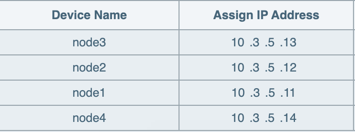

<div id="top"></div>
<!-- PROJECT SHIELDS -->

[![MIT License][license-shield]][license-url]
[![LinkedIn][linkedin-shield]][linkedin-url]

# kube
<!-- TABLE OF CONTENTS -->
<details>
  <summary>Table of Contents</summary>
  <ol>
    <li><a href="#what-is-this">What is this?</a></li>
    <li>
      <a href="#what-you-need">What you need</a>
      <ul>
        <li><a href="#what-i-use">What I ended up using</a></li>
        <ul>
          <li><a href="#computers">Computers</a></li>
          <li><a href="#storage">Storage</a></li>
          <li><a href="#networking">Networking</a></li>
          <li><a href="#misc">Misc.</a></li>
        </ul>
      </ul>
    </li>
    <li><a href="#getting-started">Getting Started</a></li>
        <ul>
          <li><a href="#setup-network">setting up the network</a></li>
        </ul>
    </li>
    <li>
      <a href="#setup-nodes">Setting up the nodes</a>
      <ul>
        <li><a href="#on-pi-imager">On Raspberry Pi Imager</a></li>
        <li><a href="#on-vscode">On Visual Studio Code</a></li>
        <ul>
          <li><a href="#connecting-to-node">connecting to node</a></li>
          <li><a href="#config-template-node">configuring template node</a></li>
          <li><a href="#flashing-new-node">flashing new node</a></li>
          <li><a href="#in-cluster-routes">adding in-cluster routes</a></li>
        </ul>
      </ul>
    </li>
  </ol>
</details>

## What is this? <div id="what-is-this"></div>
I am creating a local cloud infastructure using raspberry pi's and other computers in my house.
When I started on this I had no idea what kubernetes was or what I was getting myself into.
It's really a complex subject and I won't really go into it because I don't fully understand it,
I have a couple raspberry pi's and computers and kubernetes is a way to orchestrate everything into
a mass of CPU and RAM to run containerized applications.
## What you need <div id="what-you-need"></div>
You really only need one computer, or Raspberry Pi, or whatever. The whole point of kubernetes is 
that its very modular, which means extra computers can be added on as you get them. I added a lot of extra stuff for fun and to expirement. 
### What I ended up using <div id="what-i-use"></div>
- **Computers** <div id="computers"></div>
&nbsp; &nbsp;[Raspberry Pi 4 4GB](https://www.amazon.com/dp/B07TC2BK1X?psc=1&ref=ppx_yo2ov_dt_b_product_details) (two of them) <br>
&nbsp; &nbsp;[Seed Studio Raspberry Pi 4 8GB](https://www.amazon.com/dp/B0899VXM8F?psc=1&ref=ppx_yo2ov_dt_b_product_details) <br>
&nbsp; &nbsp;[Beelink GK35 Mini PC](https://www.amazon.com/dp/B09FDGT449?psc=1&ref=ppx_yo2ov_dt_b_product_details) <br>
- **Storage** <div id="storage"></div> 
&nbsp; &nbsp;[M.2 to USB3.0 Adapter](https://www.amazon.com/gp/product/B09GY7J6V8/ref=ppx_yo_dt_b_asin_title_o00_s00?ie=UTF8&psc=1) <br>
&nbsp; &nbsp;[WD Black 1TB NVMe M.2](https://www.amazon.com/WD_BLACK-SN770-Internal-Gaming-Solid/dp/B09QV692XY/ref=sr_1_5?crid=2WGR16TMUOV5I&keywords=black+1tb&qid=1657835177&sprefix=black+1tb%2Caps%2C117&sr=8-5) <br>
&nbsp; &nbsp;[WD Passport 2TB external HDD](https://www.amazon.com/Passport-Portable-External-Drive-Black/dp/B07VTFN6HM/ref=sr_1_3?crid=1ZJLVHBAVL1J3&keywords=passport+2tb&qid=1657835063&sprefix=passport+2%2Caps%2C125&sr=8-3) <br>
- **Networking** <div id="networking"></div>
&nbsp; &nbsp;[Gigabit Ethernet Cables](https://www.amazon.com/iMBAPrice-Snagless-Ethernet-Patch-Inches/dp/B01MR94NJY/ref=sr_1_3?crid=1KZA4Y44EIJ6V&keywords=iMBAPrice%2BCat6%2BSnagless%2BEthernet%2BPatch%2BCable%2Bin%2BWhite%2B0.5%2BFeet%2B(6%2BInches)%2B-%2B10%2BPack&qid=1657834427&s=electronics&sprefix=imbaprice%2Bcat6%2Bsnagless%2Bethernet%2Bpatch%2Bcable%2Bin%2Bwhite%2B0.5%2Bfeet%2B6%2Binches%2B-%2B10%2Bpack%2Celectronics%2C123&sr=1-3&th=1) <br>
&nbsp; &nbsp;[POE Hats](https://www.amazon.com/UCTRONICS-Raspberry-Power-Ethernet-Expansion/dp/B082ZLDMZ6/ref=sr_1_3?crid=E6357EKWA2A9&keywords=rpi+poe+hat&qid=1657834524&sprefix=rpi+poe+hat%2Caps%2C109&sr=8-3) (three of them) <br>
&nbsp; &nbsp;[Gigabit POE Switch](https://www.amazon.com/STEAMEMO-Gigabit-Ethernet-Unmanaged-Wall-Mount/dp/B08TFY4G1C/ref=sr_1_3?crid=2CZYB9IVVDKZB&keywords=STEAMEMO+5+Port+Gigabit+Ethernet&qid=1657834622&s=electronics&sprefix=steamemo+5+port+gigabit+ethernet%2Celectronics%2C104&sr=1-3) <br>
&nbsp; &nbsp;[Old Linksys Router](https://www.amazon.com/Linksys-Wireless-Dual-Band-Anywhere-EA6200/dp/B00DLYD31A/ref=sr_1_18?crid=3U640ST4RB3UV&keywords=linksys+smart+wi-fi+router&qid=1657835886&sprefix=linksys+smart+%2Caps%2C138&sr=8-18) <br>
- **Misc.** <div id="misc"></div>
&nbsp; &nbsp;[Raspberry Pi Cluster Case](https://www.amazon.com/dp/B07MW24S61?psc=1&ref=ppx_yo2ov_dt_b_product_details) <br>
&nbsp; &nbsp;[Smart Plug](https://www.amazon.com/dp/B09QFLJH8T?psc=1&ref=ppx_yo2ov_dt_b_product_details) <br>

Everything is so expensive now I bought everything throughout 3 or 4 months, whenever I could find a [Raspberry Pi](https://www.amazon.com/dp/B07TC2BK1X?psc=1&ref=ppx_yo2ov_dt_b_product_details) at a good deal. I bought the [Mini PC](https://www.amazon.com/dp/B09FDGT449?psc=1&ref=ppx_yo2ov_dt_b_product_details)  to add some power to the cluster and to add a non ARM processor because some containers have issues with the Raspberry Pi CPU. I bought the [Smart Plug](https://www.amazon.com/dp/B09QFLJH8T?psc=1&ref=ppx_yo2ov_dt_b_product_details) to monitor energy usage and make sure I wasn't bankrupting myself. The [Old Linksys Router](https://www.amazon.com/Linksys-Wireless-Dual-Band-Anywhere-EA6200/dp/B00DLYD31A/ref=sr_1_18?crid=3U640ST4RB3UV&keywords=linksys+smart+wi-fi+router&qid=1657835886&sprefix=linksys+smart+%2Caps%2C138&sr=8-18) I dug out of my closet so you really can use anything, I was hoping to use it as a nas but I'm having a hard time connecting it to the Raspberry Pi's

<!-- GETTING STARTED -->
## Getting Started <div id="setup"></div>

### setting up the network <div id="setup-network"></div>

The first step for me was to set up the router and internet connection for my cluster. ```you can skip this```
- I ran an ethernet cable from my home router to my new linksys router and plugged a power cable into it. 
- waited for the wifi network to come up and joined it.
- once I was on the network I checked my ip which was ```192.168.1.108```. 
- opened chrome and typed in the IP address for the router ```192.168.1.1```.
- configured network and changed IP address to ```10.3.5.1/24```.
- in the DHCP settings for the network I started the IP addresses for the network at ```10.3.5.9``` for personal choice, but I limited the amount of users on the network to ```91```. Since the networks netmask is ```/24```, or ```255.255.255.0```, that means we could have up to 255 IP addresses, including the router.  I limited the ammount of IP addresses for DHCP to handout, because later I am going to set up a load balancer for my cluster that will deploy services for applications on the rest of the IP's.

## Setting up the nodes <div id="setup-nodes"></div>
I set up one node initially on a small 10GB drive and then I used it to make a disk image, which I used to flash all the other nodes

In order to flash a Raspberry Pi, I like to use the [Raspberry Pi Imager](https://www.raspberrypi.com/software/). I know on the site it says it's for the Pi OS but it has ubuntu built in which is perfect for us.

### On Raspberry Pi Imager <div id="on-pi-imager"></div>
- select Ubuntu Server 20.04 64 bit
- select the disk you want to flash
- press ```ctrl+shift+x ``` for extra settings to pop up
- I change the username to andy and password to an SSH key
- flash the sd card
- put sd card in Raspberry Pi and boot up

Since I'm using my own local project router I can go into the new router address, ```10.3.5.1```, on google chrome and find the IP. If you dont have access to the router you can always use nmap to try and find it. 
  
I use Visual Studio Code for SSH. Its really simple and nice to use. I installed an ssh extension which allowed me to change my ssh configuration as needed.

### On Visual Studio Code <div id="on-vscode"></div>
**connecting to node** <div id="connecting-to-node"></div>
I click the bottom left blue corner to ssh to a connection, or in this case we need to edit the configuration file.
```sh
# ~/.ssh/config
Host node #name used for ssh
hostname 10.3.5.35 #ip address of node
user andy #username for login
identityfile ~/.ssh/node #location of ssh key
```
once my configuration for the new node is added I go back to the blue button and connect to ```node```

you should see a bunch of updates available for you to install. nice.

```sh
sudo apt update #updating repositories
sudo reboot #it makes me reboot here usually
sudo apt upgrade -y #installing updates
sudo apt autoremove -y #removing old packages
sudo reboot #restart!
```


**configuring template node** <div id="config-template-node"></div>
some initial setup is necessary for the raspberry pi to be used for kubernetes, and as a server in general. this [link](https://medium.com/@amadmalik/installing-kubernetes-on-raspberry-pi-k3s-and-docker-on-ubuntu-20-04-ef51e5e56) <a href="#sources"><sup>1</sup></a> is a great resource to check through that I have been using. I have done some things differently though.

In the case you dont have access to the router follow the tutorial in this [link](https://medium.com/@amadmalik/installing-kubernetes-on-raspberry-pi-k3s-and-docker-on-ubuntu-20-04-ef51e5e56) <a href="#sources"><sup>1</sup></a> for network setup
- add ssh key to root user's ```~/.ssh/authorized_keys```
  - I like to do this first so I can ssh to root in VSCode for file editing, however this is bad for security so maybe you shouldn't but its probably fine...
- [disable IPv6](https://pimylifeup.com/ubuntu-disable-ipv6/) <a href="#sources"><sup>2</sup></a>

- disable ssh by password if you didnt in the rpi imager ```/etc/ssh/sshd_config```
- add to ```/boot/firmware/cmdline.txt```
  copy and paste this to the begining of the file
  ```cgroup_enable=cpuset cgroup_memory=1 cgroup_enable=memory```
- in the VSCode terminal 
  ```sh
  sudo apt install docker.io -y
  sudo systemctl enable docker
  sudo systemctl start docker
  sudo systemctl status docker
  ```

**flashing new nodes** <div id="flashing-new-node"></div>
okay so now we should be good to go cluster-wise, im going to test this later on my new minipc so we will see.

This is the point where I take the SD card out and open [Etcher](https://www.balena.io/etcher/) and plug the sd card into my computer. Etcher lets you fash an sd card from another sd card which is great for what we need. So I bought target brand 64GB sd cards for like \$10 or \$12 each, which probably wasnt necessary because I want to set up a nas for my cluster to use.
- flash new sd card and plug into first node
- find node on router website and ssh
  ```sh
  sudo hostnamectl set-hostname node#
  hostname node#
  ```
- add each nodes future static IP address in ```/etc/cloud/templates/debian.hosts.tmpl``` or something
  ```sh
  # in my case 
  127.0.0.1	localhost
  127.0.1.1	node#
  
  10.3.5.11 node1 
  10.3.5.12 node2 
  10.3.5.13 node3
  10.3.5.14 node4
  ```
- repeat for each node
- set each node static ip on router website for permanent lookup


**adding in-cluster routes** <div id="in-cluster-routes"></div>
in node1 or whichever node has been designated the master node
- copy config file and ssh keys to ```~/.ssh```
- edit config file to add each node
  ```sh
  Host node1 #name used for ssh
  hostname 10.3.5.11 #ip address of node
  user andy #username for login
  identityfile ~/.ssh/node #location of ssh key

  Host node2 #name used for ssh
  hostname 10.3.5.12 #ip address of node
  user andy #username for login
  identityfile ~/.ssh/node #location of ssh key

  Host node3 #name used for ssh
  hostname 10.3.5.13 #ip address of node
  user andy #username for login
  identityfile ~/.ssh/node #location of ssh key
  ```
- create new key to ssh to each node from master
  ```sh
  cd ~/.ssh
  ssh-keygen -t rsa #i name it node
  ssh-copy-id -i ~/.ssh/node.pub node#
  ```
- install ansible for fun and ease
  ```sh
  apt install ansible
  ```
- edit ```/etc/ansible/hosts```
  ```sh
  [control]
  node1  ansible_connection=local

  [workers]
  node2 ansible_connection=ssh
  node3 ansible_connection=ssh

  [cube:children]
  control
  workers
  ```
- ping nodes with ansible
  ```sh
  ansible cube -m ping
  ```
<p align="right"><a href="#top">top</a></p>

At this point you could install kubernetes on node1 and kubernetes client on the rest of them by following the tutorial [here](https://rpi4cluster.com/k3s/k3s-kube-setting/) <a href="#sources"><sup>3</sup></a>.
However I will be installing ubuntu desktop on the minipc for the added amd core and better kube master.
The goal from here is to install a nas on node1 to which I will access from all the nodes and my pc. I also want to figure out a vpn to access the network from far away

Setting up the MiniPC has been a little different. Manual installation, no /etc/cloud folder?
followed [this](https://linuxconfig.org/how-to-disable-ipv6-address-on-ubuntu-20-04-lts-focal-fossa#:~:text=Disabling%20IPv6%20address%20on%20Ubuntu%2020.04%20LTS%20Focal%20Fossa%20step%20by%20step%20instructions&text=In%20case%20you%20need%20to,run%20the%20update%2Dgrub%20command)

Ive set up the nas on the minipc (node4) 
I had to install
```sh
sudo apt install nfs-kernel-server
sudo mkdir /nas
```
and then plug in ssd i format as NTFS so I can access outside cluster
add this to mount the ssd permanently
```sh
# /etc/fstab
UUID=456CEBF40A795F3E   /nas    ntfs    none    0   0    
```
to mount on client 
```sh
sudo apt install nfs-common
sudo mkdir /nas
```
add this to mount nfs
```sh
LABEL=writable	/	 ext4	defaults	0 1
LABEL=system-boot       /boot/firmware  vfat    defaults        0       1
10.3.5.14:/nas  /nas  auto   auto,nofail,noatime,nolock,intr,tcp,actimeo=1800    0   0
```


once nas is installed
```sh
apt install curl -y
curl -sfL https://get.k3s.io | sh -s - --write-kubeconfig-mode 644 --disable servicelb --token Donquixote0405 --node-taint CriticalAddonsOnly=true:NoExecute --bind-address 10.3.5.14 --disable-cloud-controller --disable local-storage
watch kubectl get nodes
ufw allow ssh
ufw allow 6443
ufw enable -y
ansible workers -b -m shell -a "curl -sfL https://get.k3s.io | K3S_URL=https://10.3.5.14:6443 K3S_TOKEN=Donquixote0405 sh -"
watch kubectl get nodes
kubectl label nodes node1 node2 node3 kubernetes.io/role=worker
kubectl get nodes
```
https://michael-tissen.medium.com/setting-up-an-raspberrypi4-k3s-cluster-with-nfs-persistent-storage-a931ebb85737

## Sources <div id="sources"></div>
1. [Installing Kubernetes on Raspberry Pi, K3s and Docker on Ubuntu 20.04](https://medium.com/@amadmalik/installing-kubernetes-on-raspberry-pi-k3s-and-docker-on-ubuntu-20-04-ef51e5e56)
2. [How to Disable IPv6 on Ubuntu](https://pimylifeup.com/ubuntu-disable-ipv6/)
3. [rpi4cluster.com](https://rpi4cluster.com/k3s/k3s-kube-setting/)


[license-shield]: https://img.shields.io/github/license/othneildrew/Best-README-Template.svg?style=for-the-badge
[license-url]: https://github.com/othneildrew/Best-README-Template/blob/master/LICENSE.txt
[linkedin-shield]: https://img.shields.io/badge/-LinkedIn-black.svg?style=for-the-badge&logo=linkedin&colorB=555
[linkedin-url]: https://www.linkedin.com/in/andrewjkuhl

